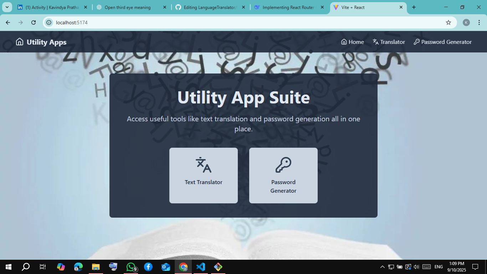

# ⚡ Utility App Suite

A React-based application that brings together useful everyday tools in one place.  
Currently includes a **Text Translator** powered by an external API and a **Random Password Generator** with clipboard support.  

---

## 🚀 Features

### 🌍 Text Translator
- Translate text from **English → Sinhala** or **Hindi**  
- Uses **RapidAPI Google Translator API**  
- Real-time loading state with spinner  
- Clean UI with input/output text areas  
- Validation: prevents translation if inputs are empty  

### 🔑 Password Generator
- Generate strong random passwords with customizable length  
- Adjustable length (minimum 8 characters)  
- Includes letters, numbers, and special symbols  
- One-click **copy to clipboard** feature  
- Automatically regenerates on length change  

### 🏠 Home Page
- Central dashboard with links to utilities  
- Responsive, modern Tailwind UI  

---

## 🛠 Tech Stack
- **Frontend:** React + Tailwind CSS  
- **Routing:** React Router DOM  
- **Icons:** lucide-react  
- **HTTP Requests:** Axios  
- **API:** Google Translator (via RapidAPI)  

---

## 📸 Screenshots

### 🔍 Home Page  


### 🌍 Translator  


### 🔑 Password Generator  


---

## ⚙️ Installation & Setup

1. Clone the repository:
   ```bash
   https://github.com/KavindyaPrathapage/LanguageTranslator.git
2. Install dependencies:
   ```bash
   npm install
3. Start development server:
   ```bash
   npm run dev
4. Open your browser:
   ```bash
   http://localhost:5173

## 🔧 Configuration
- Translator API requires a **RapidAPI key.** 
- Replace the placeholder key inside **App.jsx:**
   ```bash
   "x-rapidapi-key": "YOUR_API_KEY",
   "x-rapidapi-host": "google-translator9.p.rapidapi.com",

## 📦 Dependencies
- react
- react-dom
- react-router-dom
- axios
- lucide-react
- tailwindcss
